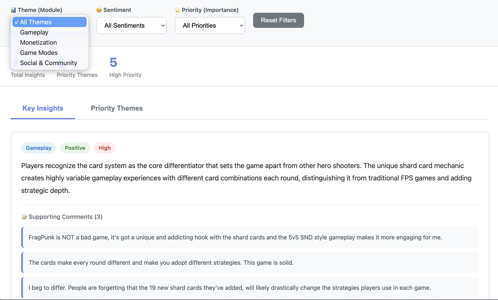

# Game Comment Analysis Scripts

This repository contains Python scripts for analyzing game comments from various sources (YouTube, Twitch, etc.) using AI-powered sentiment analysis and classification.

## Example Output

### Card System Analysis Dashboard
See `example_dashboard.html` for a sample card system analysis dashboard with English text. This demonstrates:
- Interactive statistics cards
- Visual charts showing sentiment distribution by playtime segments
- Detailed main points with supporting comments
- Organized by playtime segments (Early, Mid, Late, Veteran)

The dashboard uses sample data from `example_data.json` to show the expected output format.

### YouTube Insights Dashboard
See `example_insights_dashboard.html` for a sample YouTube insights dashboard (matching the style of `generate_insights_webpage.py`). This demonstrates:
- Interactive filtering by Theme, Sentiment, and Priority
- Bar chart showing sentiment distribution by theme
- Two tabs: "Key Insights" and "Priority Themes"
- Insight cards with badges (module, sentiment, importance)
- Supporting comments for each insight
- Real-time filter updates



*Example dashboard showing interactive filters, statistics, and key insights with supporting comments*

The dashboard uses sample data from `example_insights_data.json` to show the expected output format.


## Scripts Overview

### 1. `analyze_card_text_ai.py`
Analyzes card system text opinions by different playtime segments using AI.
- Uses Claude Haiku 4.5 for card-related content extraction and sentiment classification
- Uses Claude Sonnet 4.5 for theme analysis
- Generates interactive HTML dashboards with visualizations
- **Requires**: `ANTHROPIC_API_KEY` environment variable

### 2. `generate_insights_webpage.py`
Generates an interactive HTML webpage to visualize insights.
- Supports filtering by module (theme), sentiment, and priority
- Loads insights from JSON files
- Creates interactive dashboard with charts and filters

### 3. `theme_insight_generator.py`
Aggregates comments by category (module), sentiment, and generates theme insights.
- Uses Claude Haiku 4.5 to map comments to candidate themes
- Uses Claude Sonnet 4.5 to reduce and generate insights
- **Requires**: `ANTHROPIC_API_KEY` environment variable

### 4. `theme_analyzer.py`
YouTube comments theme-based analyzer with denoising, deduplication, and hierarchical classification.
- Classifies comments into 4 layers: module, sub-module, dimension, and sentiment
- Supports both hierarchical (modules) and legacy (themes) classification structures
- Optional RAG (Retrieval-Augmented Generation) integration for domain knowledge enhancement
- Language detection and near-duplicate removal using embeddings
- **Requires**: `OPENAI_API_KEY` environment variable (for GPT classification)
- **Optional**: RAG system (`rag_knowledge.py` or `rag_knowledge_enhanced.py`) for enhanced classification accuracy
- **Optional Dependencies**: `langdetect`, `sentence-transformers` (for advanced features)

### 5. `rag_knowledge.py` & `rag_knowledge_enhanced.py`
RAG (Retrieval-Augmented Generation) knowledge base systems for game comments.
- `rag_knowledge.py`: Basic RAG system for FragPunk domain knowledge
- `rag_knowledge_enhanced.py`: Enhanced RAG with hybrid retrieval (semantic + keyword matching)
- Supports both DOCX and JSONL knowledge sources
- **Used by**: `theme_analyzer.py` (optional dependency for enhanced classification)
- **Requires**: `OPENAI_API_KEY` environment variable

### 6. `twitch_sentiment.py`
Twitch comment sentiment analysis and marketing funnel classification tool.
- Two-step process: lightweight filtering + OpenAI GPT-4o classification
- Classifies comments into 5 marketing funnel categories
- **Requires**: `OPENAI_API_KEY` environment variable

## Installation

1. Clone this repository
2. Install dependencies:
```bash
pip install -r requirements.txt
```

## Configuration

### Environment Variables

Set the following environment variables based on which scripts you want to use:

```bash
# For Anthropic Claude API (analyze_card_text_ai.py, theme_insight_generator.py)
export ANTHROPIC_API_KEY="your-anthropic-api-key"

# For OpenAI API (theme_analyzer.py, rag_knowledge.py, twitch_sentiment.py)
export OPENAI_API_KEY="your-openai-api-key"
```

### File Paths

Some scripts have hardcoded paths that you may need to update:

- `twitch_sentiment.py`: Update `REPLAY_DIR` and `OUTPUT_DIR` variables
- `analyze_card_text_ai.py`: Update the card file path in `main()` function
- `theme_analyzer.py`: Update JSONL file paths in the RAG initialization section (lines 96-100) if using RAG
- `rag_knowledge.py` / `rag_knowledge_enhanced.py`: Update document paths in test sections

## Usage Examples

### Analyze Card System Reviews
```bash
python analyze_card_text_ai.py
```

### Generate Theme Insights
```bash
python theme_insight_generator.py processed_comments.csv
```

### Analyze YouTube Comments with Theme Classification
```bash
# Basic usage with GPT classification
python theme_analyzer.py comments.csv

# With RAG enhancement for better accuracy
python theme_analyzer.py comments.csv --use-rag --rag-docx "/path/to/glossary.docx"

# Use single API call mode (faster, cheaper)
python theme_analyzer.py comments.csv --single-call

# Keyword-based classification (no API cost)
python theme_analyzer.py comments.csv --no-gpt
```

### Generate Insights Webpage
```bash
python generate_insights_webpage.py --results-dir insights_results --output dashboard.html
```

### Analyze Twitch Comments
```bash
python twitch_sentiment.py
```

## Dependencies

See `requirements.txt` for the complete list. Main dependencies include:
- `pandas` - Data manipulation
- `numpy` - Numerical operations
- `anthropic` - Claude API client
- `openai` - OpenAI API client
- `plotly` - Interactive visualizations
- `python-docx` - Word document processing
- `tiktoken` - Token counting
- `tqdm` - Progress bars
- `pyyaml` - YAML configuration parsing

### Optional Dependencies

Some scripts have optional dependencies for enhanced features:
- `langdetect` - Language detection (for `theme_analyzer.py`)
- `sentence-transformers` - Near-duplicate detection (for `theme_analyzer.py`)
- `scikit-learn` - Cosine similarity calculations (for `theme_analyzer.py`)

### Script Dependencies

- **`theme_analyzer.py`** optionally uses **`rag_knowledge.py`** or **`rag_knowledge_enhanced.py`** for domain knowledge enhancement. When RAG is enabled, it provides game-specific context to improve classification accuracy. The RAG system retrieves relevant game knowledge (characters, weapons, modes, cosmetics) to help classify comments more accurately.

## Notes

- All scripts have been translated to English
- Some scripts may require specific input file formats (CSV, JSON, DOCX)
- API rate limits may apply - scripts include rate limiting delays
- Output directories are created automatically if they don't exist

## Contributing

Contributions are welcome! Please see [CONTRIBUTING.md](CONTRIBUTING.md) for guidelines.

## License

This project is licensed under the MIT License - see the [LICENSE](LICENSE) file for details.


## Changelog

See [CHANGELOG.md](CHANGELOG.md) for a list of changes and version history.

